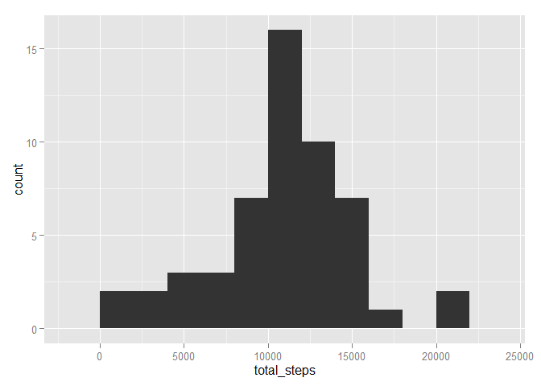
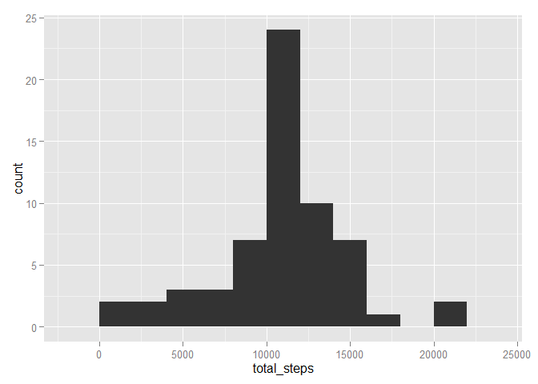

# Reproducible Research: Peer Assessment 1


## Loading and preprocessing the data

```r
# Loading packages
library(lubridate)      # Working with dates
library(dplyr)          # Working with tables
library(ggplot2)        # Working with plots

# Setting the working directory
setwd("E:\\Dev\\R\\Coursera\\5 Reproducible Research\\RepData_PeerAssessment1\\")

# Reading the CSV into a variable
activity_source <- read.csv(unz('activity.zip', 'activity.csv'), sep = ',', header = TRUE, stringsAsFactors = FALSE)

# Read the source table into a new variable using dplyr
activity_table <- tbl_df(activity_source)

# Remove the source table
rm("activity_source")

# Transform date to a date class
activity_table <- mutate(activity_table, date = ymd(date))

# Create activity tables not containing NA values for steps and a table which contains the NA values
activity_no_na <- activity_table[!is.na(activity_table$steps),]
activity_na <- activity_table[is.na(activity_table$steps),]
```

## What is mean total number of steps taken per day?

```r
# Mean and median total number of steps per day
group_by_date_no_na <- group_by(select(activity_no_na, -interval), date)
by_day_no_na <- summarize(group_by_date_no_na, total_steps = sum(steps))
by_day_no_na
```

```
## Source: local data frame [53 x 2]
## 
##          date total_steps
## 1  2012-10-02         126
## 2  2012-10-03       11352
## 3  2012-10-04       12116
## 4  2012-10-05       13294
## 5  2012-10-06       15420
## 6  2012-10-07       11015
## 7  2012-10-09       12811
## 8  2012-10-10        9900
## 9  2012-10-11       10304
## 10 2012-10-12       17382
## ..        ...         ...
```

```r
# Total number of steps per day histogram
qplot(total_steps, data = by_day_no_na, binwidth=2000)
```

 

```r
#mean
mean(by_day_no_na$total_steps)
```

```
## [1] 10766.19
```

```r
#median
median(by_day_no_na$total_steps)
```

```
## [1] 10765
```


## What is the average daily activity pattern?

```r
# Mean and median total number of steps per day
group_by_interval_no_na <- group_by(select(activity_no_na, -date), interval)
by_interval_no_na <- summarize(group_by_interval_no_na, mean_steps = mean(steps))
qplot(interval, mean_steps , data = by_interval_no_na, geom="line")
```

 

```r
# The 5-minute interval with on average the most number of steps
select(filter(by_interval_no_na, mean_steps==max(mean_steps)), mean_steps)
```

```
## Source: local data frame [1 x 1]
## 
##   mean_steps
## 1   206.1698
```


## Inputing missing values

```r
# The total number of NA values for steps in the intervals
nrow(activity_na)
```

```
## [1] 2304
```

```r
# Correcting the NA values in a copy of the activity_na table using the mean of the corresponding interval
activity_na_corrected <- activity_na

for (i in 1:nrow(activity_na_corrected)) {
        
        # Get the interval from the row to be corrected
        interval_to_find <- activity_na_corrected[i,]$interval
        
        # Get the mean_steps from the by_interval table for the interval
        mean_steps_found <- by_interval_no_na[by_interval_no_na$interval== interval_to_find, ]$mean_steps
        
        # Update the steps with the found mean_steps
        activity_na_corrected[i,]$steps <- mean_steps_found
}

# Recreate the dataset with all dates and all intervals 
# by concatenating activity_no_na with activity_na_corrected
activity_new <- rbind(activity_na_corrected, activity_no_na)

# Check of there are no more NA values for steps
summary(activity_new$steps)
```

```
##    Min. 1st Qu.  Median    Mean 3rd Qu.    Max. 
##    0.00    0.00    0.00   37.38   27.00  806.00
```

```r
# Mean and median total number of steps per day
group_by_date_new <- group_by(activity_new, date)
by_day_new <- summarize(group_by_date_new, total_steps = sum(steps))

qplot(total_steps, data = by_day_new, binwidth=2000)
```

 

```r
#mean
mean(by_day_new$total_steps)
```

```
## [1] 10766.19
```

```r
#median
median(by_day_new$total_steps)
```

```
## [1] 10766.19
```


## Are there differences in activity patterns between weekdays and weekends?
