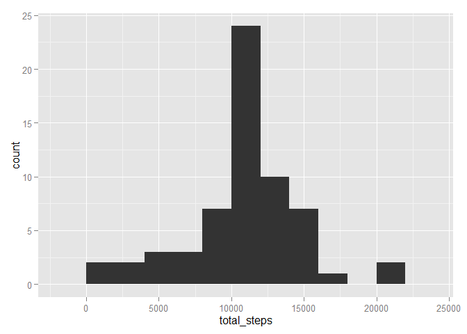
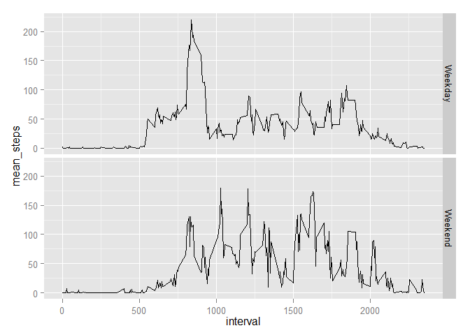

# Reproducible Research: Peer Assessment 1


## Loading and preprocessing the data

```r
# Load packages we are going to work with
library(lubridate)      # Working with dates
library(dplyr)          # Working with tables
library(ggplot2)        # Working with plots

# Set the locale the english
Sys.setlocale("LC_TIME", "English")
```


```r
# Set the working directory
setwd("E:\\Dev\\R\\Coursera\\5 Reproducible Research\\RepData_PeerAssessment1\\")

# Read the CSV into a variable
activity_source <- read.csv(unz('activity.zip', 'activity.csv'), sep = ',', header = TRUE, stringsAsFactors = FALSE)

# Read the source table into a new variable using dplyr
activity_table <- tbl_df(activity_source)

# Remove the source table
rm("activity_source")

# Transform date to a date class
activity_table <- mutate(activity_table, date = ymd(date))

# Create an activity table not containing NA values for steps
activity_no_na <- activity_table[!is.na(activity_table$steps),]

# Create an activity table containing NA values for steps. We will correct them later.
activity_na <- activity_table[is.na(activity_table$steps),]
```

## What is mean total number of steps taken per day?

```r
# Calculate the total number of steps per day
group_by_date_no_na <- group_by(select(activity_no_na, -interval), date)
by_day_no_na <- summarize(group_by_date_no_na, total_steps = sum(steps))

# Histogram
qplot(total_steps, data = by_day_no_na, binwidth=2000)
```

 

```r
# Mean of the total steps per day
mean(by_day_no_na$total_steps)
```

```
## [1] 10766.19
```

```r
# Median of the total steps per day
median(by_day_no_na$total_steps)
```

```
## [1] 10765
```


## What is the average daily activity pattern?

```r
# Calculate the average amount of steps per interval across all dates
group_by_interval_no_na <- group_by(select(activity_no_na, -date), interval)
by_interval_no_na <- summarize(group_by_interval_no_na, mean_steps = mean(steps))

# Line plot
qplot(interval, mean_steps , data = by_interval_no_na, geom="line")
```

 

```r
# The 5-minute interval with on average the most steps
filter(by_interval_no_na, mean_steps==max(mean_steps))
```

```
## Source: local data frame [1 x 2]
## 
##   interval mean_steps
## 1      835   206.1698
```


## Inputing missing values

```r
# The total number of NA values for steps in the intervals
nrow(activity_na)
```

```
## [1] 2304
```

```r
# Correct the NA values in a copy of the activity_na table 
# using the mean of the corresponding interval from the by_interval_no_na table
activity_na_corrected <- activity_na

for (i in 1:nrow(activity_na_corrected)) {
        
        # Get the interval from the row to be corrected
        interval_to_find <- activity_na_corrected[i,]$interval
        
        # Get the mean_steps from the by_interval table for the interval
        mean_steps_found <- by_interval_no_na[by_interval_no_na$interval== interval_to_find, ]$mean_steps
        
        # Update the steps with the found mean_steps
        activity_na_corrected[i,]$steps <- mean_steps_found
}

# Recreate the complete dataset with all dates and all intervals 
# by concatenating activity_no_na with activity_na_corrected
activity_new <- rbind(activity_na_corrected, activity_no_na)

# Check of there are no more NA values in the steps field
summary(activity_new$steps)
```

```
##    Min. 1st Qu.  Median    Mean 3rd Qu.    Max. 
##    0.00    0.00    0.00   37.38   27.00  806.00
```

```r
# Calculate the total number of steps per day
group_by_date_new <- group_by(activity_new, date)
by_day_new <- summarize(group_by_date_new, total_steps = sum(steps))

# Line plot the total number of steps per day
qplot(total_steps, data = by_day_new, binwidth=2000)
```

 

```r
# Mean of the total steps per day
mean(by_day_new$total_steps)
```

```
## [1] 10766.19
```

```r
# Median of the total steps per day
median(by_day_new$total_steps)
```

```
## [1] 10766.19
```

From the mean, median and histogram of the corrected dataset, we conclude that:
* Correcting the NA values for steps with an average of steps from the corresponding interval, did not change the mean of total steps per day
* The histogram of total steps per day only changed for the median of the total steps


## Are there differences in activity patterns between weekdays and weekends?

```r
# Create a weekday field based on the day of the week
activity_new <- mutate(activity_new, weekday = ifelse(weekdays(date)=="Sunday" | weekdays(date)=="Sunday", "Weekend", "Weekday"))

# Calculate the average steps per interval per weekday
group_by_weekday_interval <- group_by(activity_new, weekday, interval)
weekday_interval_mean <- summarize(group_by_weekday_interval, mean_steps = mean(steps))

# Plot
qplot(interval, mean_steps, facets = weekday ~ ., data = weekday_interval_mean, geom="line")
```

 


